# 📊 Retail Sales Analysis Using SQL

## 📁 Project Files

- **Dataset:** `retail_sales.csv`  
- **SQL Script:** `SQL_Query_Retail_Sales.sql`  
- **Tool Used:** SQL Server Management Studio (SSMS)

---

## 🎯 Project Objective

The objective of this project is to **practice SQL** by working with a retail dataset. The goal is to **clean the data, perform CRUD operations, explore the dataset**, and **extract actionable business insights**.

---

## 🧭 Project Workflow

1. **Database Setup:** Create and populate the SQL database.
2. **CRUD Operations:** Apply Create, Read, Update, Delete operations to manage data.
3. **Data Cleaning:** Ensure data consistency and remove invalid entries.
4. **Exploratory Data Analysis (EDA):** Generate questions and explore the dataset.
5. **Insights Delivery:** Extract and present key business insights.

---

## 🛠️ Database Preparation & Cleaning

### ✅ Setting up the Database

The retail data was imported into SQL Server Management Studio and formatted using the following operations:

```sql
Changing the data type from the DB
ALTER TABLE retail_sales
alter column transactions_id INT not null

ALTER TABLE  retail_sales
alter column sale_date date

ALTER Table retail_sales
alter column sale_time TIME

Alter table retail_sales
alter column customer_id INT

alter Table retail_sales
alter column gender varchar(15)

alter table retail_sales
alter column age int

alter table retail_sales
alter column category varchar(15)

alter table retail_sales
alter column quantiy INT

alter table retail_sales
alter column price_per_unit float

alter table retail_sales
alter column cogs float

alter table retail_sales
alter column total_sale float

ALTER TABLE retail_sales
add primary key (transactions_id)

-- Data Cleaning
select 
	count(*)
from retail_sales

-- Verifying if we have null's in the DB.
select *
from retail_sales
where 
	transactions_id is null
	or
	sale_date is null
	or
	sale_time is null
	or 
	gender is null
	or
	age is null
	or
	category is null
	or
	quantiy is null
	or 
	price_per_unit is null
	or
	cogs is null
	or
	total_sale is null

-- In case we have null's, we need to delete those rows.

delete from retail_sales
where 
	transactions_id is null
	or
	sale_date is null
	or
	sale_time is null
	or 
	gender is null
	or
	age is null
	or
	category is null
	or
	quantiy is null
	or 
	price_per_unit is null
	or
	cogs is null
	or
	total_sale is null
```
## 🔎 Exploratory Data Analysis (EDA)

The goal of this stage is to explore trends and patterns in the dataset that can lead to actionable insights.

1. Review the number of unique customers that exist in the dataset.
```sql
-- Startin with # of customers.

select count(distinct (customer_id)) as CustomerNumber
from retail_sales
```
_Result:_ 155 unique customers.

2. How many categories do we have?
```sql
-- How many categories do we have.
select distinct category as Categories
from retail_sales
```
_Result:_ Clothing, Electronics, Beauty
 
3. Which category has the most sales?
```sql
select 
	category,
	count(category) as Trasnactions,
	sum(quantiy) as QTY_Of_Pieces_sold,
	sum(total_sale) as Total_Sales
from retail_sales
group by category
Order by Total_sales desc
```
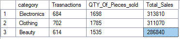

4. Which one is the biggest buyer | The one with the most transactions done.
```sql
select
	top 15
	customer_id, 
	count(customer_id) as NumberOfTransactions
from retail_sales
group by customer_id
order by NumberOfTransactions desc
```

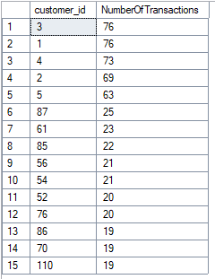

5. Which client purchased the most items?
```sql
select 
	top 15
	customer_id, 
	sum(quantiy) as QTY
from retail_sales
group by customer_id
order by QTY desc
```

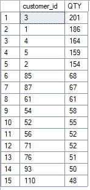

6. Which client spend the most?
```sql
select 
	customer_id, 
	count(customer_id) as Transactions, 
	sum(total_sale) as TotalAmmount
from retail_sales
group by customer_id
order by TotalAmmount desc
```

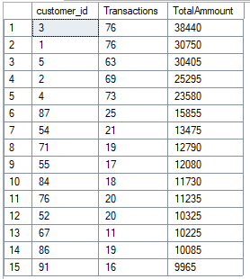

---

## 📝 First Findings

- We know which clients have the most transactions.
- We know which clients bought the most products.
- We know which clients spent the most.

**Even though client_id #5 is not in the top 3 of the most transactions or products bought, it's the 3rd with the most amount of money spent.**

*This opens a new set of questions regarding our clients.*

7. Which products did customer 3 and 5 buy the most?
``` SQL
select 
	category, 
	count(category) as Transactions, 
	sum(total_sale) as Total_Amount
from retail_sales
where customer_id = 3
group by category
order by Transactions desc
```
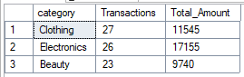

```SQL
select 
	category, 
	count(category) as Transactions, 
	sum(total_sale) as Total_Amount
from retail_sales
where customer_id = 5
group by category
order by Transactions desc 
```

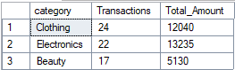


8. With this new information, we want to know how much is spent on each transaction for each category.
```sql
select 
	category, 
	count(category) as Transactions, 
	round(avg(total_sale),2) as Avg_Total_Amount
from retail_sales
group by category
order by Transactions desc 
```

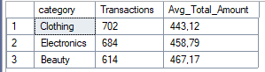

9. Now that we know which category has the most transactions and spend the most, we want to know when those transactions are done.
```SQL
-- Calculate the avg sales for each month.
select
	YEAR(sale_date) as year,
	month(sale_date) as month,
	avg(total_sale) as Avg_sale
from retail_sales
group by YEAR(sale_date), month(sale_date)
order by year, month
```

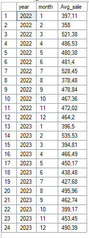

10. Which month has the best AVG sale per year.
```SQL
with monthly_avg_sale as(
	select
		YEAR(sale_date) as year,
		month(sale_date) as month,
		round(avg(total_sale),2) as Avg_sale
	from retail_sales
	group by YEAR(sale_date), month(sale_date)
), 
ranked_sales as (
	select
		*, RANK() OVER (PARTITION BY year ORDER BY avg_sale DESC) AS sales_rank
	from monthly_avg_sale
				)
	select *
	from ranked_sales
	where sales_rank = 1
```
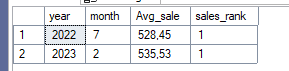

11. What day did we had the most sales?
```SQL
select 
	sale_date, 
	sum(customer_id) as transactions
from retail_sales
group by sale_date
order by transactions desc
```
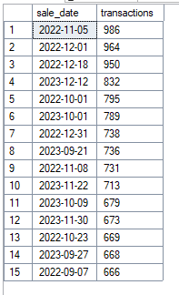

12. What was sold that day?
```SQL
-- 2022-11-05 is the day with the most transactions.
select *
from retail_sales
where sale_date = '2022-11-05'

select 
	category, 
	count(*) as Transactions
from retail_sales
where 
	sale_date = '2022-11-05'
group by category
order by Transactions desc
```

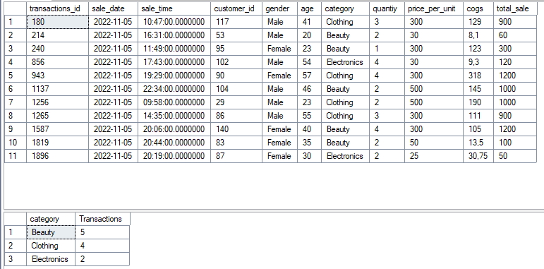

13. Which shift sold the most?

For this, we need to create first "Shifts" in SQL. To know when does this shifts starts and ends, we need to know the hours that they can work.
```SQL
select sale_time
from retail_sales
order by sale_time asc
```
		From 6 AM to 11 PM. (Or, in this case from 6:00 to 23:00)

We need to create shifts that cover all the working time.
```SQL
SELECT *,
  CASE
    WHEN sale_time BETWEEN '06:00:00' AND '12:00:00' THEN 'Morning Shift'
    WHEN sale_time BETWEEN '12:00:01' AND '20:00:00' THEN 'Afternoon Shift'
    ELSE 'Night Shift'
  END AS shift
FROM retail_sales;
```
		This will create 3 shifts.

Which shift sold the most?

```SQL
with hourly_sales as (
	SELECT *,
	  CASE
		WHEN sale_time BETWEEN '06:00:00' AND '12:00:00' THEN 'Morning Shift'
		WHEN sale_time BETWEEN '12:00:01' AND '20:00:00' THEN 'Afternoon Shift'
		ELSE 'Night Shift'
	  END AS shift
	FROM retail_sales
)
select
	shift,
	count(*) as Transactions,
	sum(total_sale) as TotalSale
from hourly_sales
group by shift
order by TotalSale desc
```
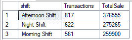

## 📝 Final Findings

- We know which category has the most transactions; with this information, we can improve or plan new discounts for those categories that need to increase sales.
- We know when it's the best time for sales. Not only the time of the year, but the specifics of the hour and shift.
- We also know when it's imperative to have discounts to improve sales.
- We also know what time of day has the most transactions. So we can improve or increase the number of employees attending each shift.


